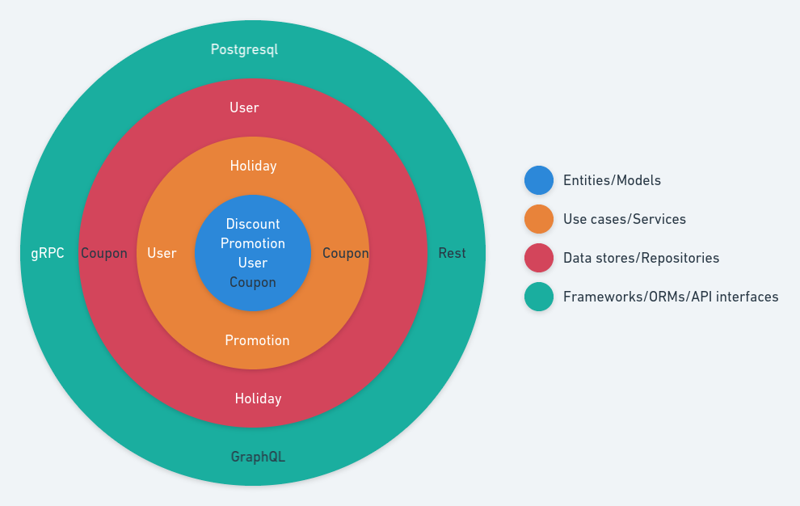

[](https://github.com/PyCQA/bandit)

# Promotion service

Handle promotions for your ecommerce store.

Implemented promotions:

* Discount: Add a discount to your products.
  - Birhtday: Date a person was born.
* Holiday: Configured date.
  - Black friday: If it is the configured date.

Most popular types of sales promotions:

* Free Shipping/Free Returns
* Flash Sale
* Buy More, Save More
* Product Giveaways/Branded Gifts
* Loyalty Points
* Coupon Giveaway
* Competitions
* Price Match Promise

From the list above, of the most popular types of promotions this is the type of service
that should be developed to be easy extended and thus decrease lead time.

With that in mind the code has a great influence of clean architecture and
hexagonal architecture with a few hints of SOLID

The figure below depicts how the solution was architected:

[](./docs/img/architecture.png)

and below how the source code was structured:

```
.
├── api
│   └── ...
├── promotion
│   ├── command
│   │   └── ...
│   ├── entity.py
│   ├── grpc
│   ├── holiday.py
│   ├── __init__.py
│   ├── postgresql
│   │   ├── __init__.py
│   │   └── user.py
│   ├── protocol.py
│   ├── settings
│   │   ├── holiday.py
│   │   └── __init__.py
│   └── user.py
└── tests
    └── ...
```

* `api`: gRPC protocol definition.
* `promotion`: Root module interface definition and use case implementation exist here.
  * `command`: Command line interfaces like daemons and clients.
  * `entity.py`: Internal only data structure representation.
  * `grpc`: gRPC generate stubs and server implementation.
  * `holiday.py`: Holiday use case implementation.
  * `__init__.py`: Promotion use case implementation.
  * `postgresql`: Postgresql data store implementation.
    - `__init__.py`: SQLAlchemy model definition.
    - `user.py`: User data store implementation.
  * `protocol.py`: Interface definition using typing Protocol
  * `settings`: Environment variable data store implementation.
    - `holiday.py`: Holiday data store implementation.
    - `__init__.py`: Configuration settings.
  * `user.py`: User use case implementation.
* `tests`: gRPC protocol definition.

The main reason for this is to build a solution to middle-to-long tream.

## Requirements

* Python 3.8
* Postgresql

## Local development

Clone:
```
git clone https://github.com/wiliamsouza/promotion.git

```
The recomended way to get it is through https://github.com/wiliamsouza/maketplace

Install:
```
python setup.py develop
```
This will install two commands:

* promotionctl: Promotion control command line interface.
* promotiond: Promotion daemon command line interface.

Each command has it own help:
```
$ promotionctl 
Usage: promotionctl [OPTIONS] COMMAND [ARGS]...

  Promotion control command line interface.

Options:
  --help  Show this message and exit.

Commands:
  client    Clients for promotion and user.
  database  Database management commands.
```
and:

```
$ promotiond
Usage: promotiond [OPTIONS] COMMAND [ARGS]...

  Promotion daemon command line interface.

Options:
  --help  Show this message and exit.

Commands:
  serve  Start daemon.
```

Development requirements:

```
pip install .[dev]
```

Tests requirements:

```
pip install .[test]
```

## Makefile

Run `make` to see help.

```
help                           Show Help
security                       Run security code checks
typping                        Run static type checker
lint                           Run lint
check                          Run pylint, mypy and bandit
test                           Run tests
install                        Install system wide
```

Before run tests start database:

```
docker-compose up
```

## Docker

Build:

```bash
docker build -t wiliam.dev/promotion .
```

Run:

```bash
docker run --env-file local.env --rm wiliam.dev/promotion
